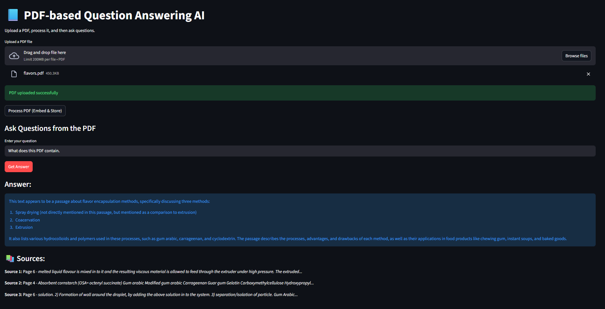

# 📘 PDF Question Answering System (RAG)

A high-performance, privacy-preserving **Retrieval-Augmented Generation (RAG)** system designed for multi-user environments.
Users can upload a PDF and interact with its content using advanced AI — with all data processed **entirely in memory**, ensuring confidentiality and isolation across sessions.

This system integrates **Groq Llama 3.3 70B**, **ChromaDB**, and **state-of-the-art embedding models** to deliver fast, accurate, and reliable document understanding.

🌐Visit my project website: [PDF_bot](https://pdfbot-alit4bjkyyblxxerbmqxjr.streamlit.app/)

📺Video link: [YouTube](https://youtu.be/9psGvn9Pqpc?si=FwMYgZlgCI8DHIOL)

---

## 🧩 Key Highlights

### 🔒 **Privacy by Design**

* No file storage, no logs, no local caching.
* All PDF bytes, embeddings, and vectorstore content exist **only for the active session** and are automatically destroyed on refresh.

### 🧠 **Enterprise-Grade RAG Pipeline**

* Powered by **Groq’s Llama 3.3 70B**, enabling near-real-time inference with exceptional contextual reasoning.
* Uses **BAAI/bge-small-en-v1.5** embeddings for superior semantic retrieval.
* Multi-stage filtering ensures only relevant chunks reach the LLM for answer generation.

### 👥 **Multi-User Safe**

* Each user session runs in an isolated `session_state` container.
* Vectorstores and uploaded files are never shared across users, enabling safe public deployment.

### 🧱 **Production-Ready Architecture**

A clean, modular, and scalable layout separating:

* UI layer (Streamlit)
* RAG engine (chunking, embeddings, vectorstore)
* LLM reasoning pipeline
* Config and environment management

Ideal for extension into full-scale enterprise document intelligence systems.

---

## 📂 Project Structure

```
PDF_bot/
│
├── app.py                   # Streamlit UI (upload, query, render)
├── requirements.txt         # Dependency list
├── .env                     # API keys (excluded from Git)
│
├── images/                  # Assets for README/UI
│   └── UI.png               # UI screenshot
│
├── app/                     # Core application logic
│   ├── __init__.py
│   ├── config.py            # Model, API keys, and environment config
│   ├── pdf_loader.py        # PDF → text extraction
│   ├── splitter.py          # Document chunking logic
│   ├── text_embeddings.py   # Embedding model loader
│   ├── vectorstore_db.py    # In-memory ChromaDB instance
│   └── rag_pipeline.py      # Retrieval + LLM generation pipeline
│
└── Summary.pdf              # Project summary document

```

---

## 🛠️ Installation & Setup

**Clone the repository:**

```bash
git clone https://github.com/GauravPatil04/PDF_bot.git
cd rag_project
```

**Install Dependencies:**
```bash
pip install -r requirements.txt
```

**Configure API Keys:**

Create a **.env** file in the root directory and add your Groq API Key:
```bash
GROQ_API_KEY=gsk_your_actual_key_here
```
**Run the App:**
```bash
streamlit run app.py
```

## 💡 How It Works (The Workflow)

**Upload:** The user uploads a PDF. The file is read into memory as bytes.

**Extraction:** PDF_loader.py converts these bytes into raw text.

**Chunking:** splitter.py divides the text into smaller, manageable pieces (e.g., 1000 characters).

**Embedding:** vectorstore_DB.py uses text_embeddings.py to convert these chunks into numerical vectors.

**Storage:** These vectors are stored in a ChromaDB instance inside RAM.

**Retrieval:** When a question is asked, RAG_system_pipeline.py searches the RAM database for relevant chunks and sends them to the Groq LLM to generate an answer.

**Reset:** Clicking "Refresh" in the browser clears st.session_state, effectively destroying the database and protecting user privacy.

## 🖼️ UI Preview



---

## 🤝 Contributing

Contributions are welcome!
If you would like to propose improvements, open an issue or submit a pull request.
Whether it's optimizing retrieval, improving UX, or adding new LLM support — community contributions are appreciated.

---
## Technology


---